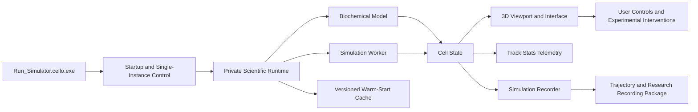

# Cello v1.1.0


**Cello is an interactive biochemical cell simulator and developer-oriented visualization platform.**

Cello provides a portable Windows environment for exploring cellular components, biochemical processes, dynamic model state, metabolic activity, and experimental interventions through an interactive three-dimensional interface.

Version 1.1.0 expands the research workflow with persistent simulation recording and live scientific telemetry while retaining the established portable Windows architecture.

## Download

Download the current Windows build from the repository's **Releases** page:

**[Download the latest Cello release](../../releases/latest)**

The current release asset is:

`cello_1.1_windows_x64.zip`

Do not download the automatically generated GitHub “Source code” ZIP expecting the application. The executable Windows build is attached separately as a release asset.

## Install and run

1. Download `cello_1.1_windows_x64.zip` from GitHub Releases.
2. Extract the entire ZIP to a normal folder.
3. Open the extracted `Cello_1.1_Portable` folder.
4. Run `Run_Simulator.cello.exe`.
5. Keep `_cello_runtime` beside the launcher; it contains Cello's private scientific runtime.

The first launch initializes the biochemical model, 3D viewport, simulation worker, and initial cell state. Later launches can use a versioned warm-start cache and should normally start faster.

Full instructions: **[INSTALL.md](INSTALL.md)**

## Current capabilities

* Interactive three-dimensional biochemical cell visualization
* Dynamic biochemical simulation
* Experimental controls for molecules, hormones, enzymes, and cellular interventions
* Active-process and model-status inspection
* Cell-state and simulation timeline panels
* Persistent simulation recording
* Structured trajectory export
* Recording metadata and provenance preservation
* Automatic recording summary figures
* Live research telemetry through Track Stats
* Real-time ATP and intracellular glucose visualization
* Real-time glycolysis, TCA-cycle, and ATP synthase flux visualization
* Live viability, intracellular pH, and membrane-potential monitoring
* Entity-change tracking during recorded simulations
* Dark and light themes
* Responsive layout from 1024×680 upward
* Save, load, export, and research-oriented interface tools
* Single-instance startup behavior
* Portable Windows deployment with no separate Python installation

## Record Simulation

Cello v1.1.0 introduces a dedicated **Record Simulation** workflow for preserving simulation trajectories independently of the normal rolling interface history.

Recording captures the evolving simulation state together with contextual information required to interpret the run.

Recorded information includes:

* simulation time series
* biochemical cell-state variables
* metabolic fluxes
* simulation parameters
* selected biological profile
* environment configuration
* biosettings
* entity configuration
* entity additions, updates, and removals
* software and model version information
* recording duration and sample information

The recording system targets an approximately 0.10-second sampling interval using the simulation's live state snapshots.

When recording is stopped, Cello can save a structured recording package containing:

```text
trajectory.csv
recording.json
figures/
    summary_300dpi.png
    summary.pdf
README.txt
manifest.json
```

`trajectory.csv` contains the recorded time-series data.

`recording.json` preserves recording metadata, model context, parameters, entities, environment information, and provenance.

The `figures` directory contains automatically generated graphical summaries of the recorded run.

`manifest.json` provides integrity information for the recording package contents.

If Cello closes unexpectedly while an active recording exists, the application attempts to preserve the session as a recovery recording.

## Track Stats

Cello v1.1.0 also introduces **Track Stats**, a live research telemetry overlay displayed directly over the simulation workspace.

The overlay reports current simulation information including:

* simulation time
* viability
* intracellular pH
* membrane potential

It also maintains live plots for:

### Cellular concentrations

* ATP
* intracellular glucose

### Metabolic fluxes

* glycolysis
* TCA cycle
* ATP synthase

Telemetry is driven directly from the active simulation state rather than a separate synthetic visualization process.

The overlay maintains a bounded live history to preserve responsiveness during longer simulation sessions and supports both light and dark application themes.

## Architecture

The packaged application is organized around a launcher, bundled scientific runtime, biochemical model, simulation worker, recording system, telemetry layer, state/model services, and 3D viewport.



Read the architecture overview: **[docs/ARCHITECTURE.md](docs/ARCHITECTURE.md)**

## Versioning and releases

Cello uses semantic versioning:

```text
MAJOR.MINOR.PATCH
```

* **MAJOR:** incompatible architectural or model changes
* **MINOR:** new backward-compatible features
* **PATCH:** fixes, packaging improvements, and small refinements

Version history is recorded in **[CHANGELOG.md](CHANGELOG.md)** and **[versions/](versions/README.md)**.

Compiled builds are distributed through GitHub Releases rather than committed directly to the repository.

## Scientific scope

Cello is a research-beta simulator and visualization environment.

It is not a validated digital twin, clinical device, patient-specific predictor, diagnostic system, treatment-selection system, or substitute for laboratory or clinical validation.

Simulation output reflects the assumptions, equations, parameters, and abstractions implemented in the model.

The default parameters are transparent modeling priors rather than a fit to a named cell line, tissue, organism, patient, or clinical cohort.

Recording and visualization features preserve and display model-generated simulation output; they do not independently validate the biological accuracy of that output.

See **[docs/SCIENTIFIC_SCOPE.md](docs/SCIENTIFIC_SCOPE.md)**.

## Repository status

This repository serves as the official public distribution, documentation, versioning, and issue-tracking home for Cello.

The compiled Windows release is distributed through GitHub Releases.

Source-code publication status is documented in **[SOURCE_STATUS.md](SOURCE_STATUS.md)**.

## Integrity verification

SHA-256 for the official Cello v1.1.0 Windows ZIP:

```text
f807b7c2a9559f4983997247f2125ed645314d35876bc36120567527eae3ffe2
```

Release asset:

```text
cello_1.1_windows_x64.zip
```

The v1.1.0 application executable preserved inside the release has SHA-256:

```text
cadd7999ebffc741cd9a9d735c7a25b34246e8efca3b94fc23c102dc311e01e9
```

Verification instructions are included in **[INSTALL.md](INSTALL.md)**.

# Changelog

All notable changes to Cello are documented here.

The project follows semantic versioning and uses GitHub Releases for downloadable compiled builds.

## [1.1.0] — 2026-08-29

### Added

#### Record Simulation

* Added a dedicated **Record Simulation** control
* Added persistent simulation trajectory capture
* Added approximately 0.10-second target sampling
* Added structured CSV trajectory export
* Added recording metadata and provenance
* Added simulation parameter preservation
* Added biological profile preservation
* Added environment and biosettings preservation
* Added entity configuration preservation
* Added entity add, update, and removal history
* Added software and model version metadata
* Added recording duration and sample-count metadata
* Added automatic 300 DPI PNG summary figures
* Added automatic PDF summary figures
* Added recording-package manifest generation
* Added member-level integrity hashes
* Added recovery-recording behavior for interrupted sessions

#### Track Stats

* Added the **Track Stats** live research telemetry overlay
* Added live simulation-time reporting
* Added live viability reporting
* Added live intracellular pH reporting
* Added live membrane-potential reporting
* Added ATP concentration plotting
* Added intracellular glucose plotting
* Added glycolysis-flux plotting
* Added TCA-cycle-flux plotting
* Added ATP-synthase-flux plotting
* Added bounded telemetry history for long-running sessions
* Added telemetry redraw throttling for interface responsiveness
* Added light-theme support
* Added dark-theme support
* Added direct integration with live simulation snapshots

### Improved

* Updated application version to 1.1.0
* Updated Windows application metadata
* Updated Cello single-instance identifier
* Expanded research-output capabilities
* Expanded simulation-state observability
* Improved provenance preservation for saved simulation runs
* Preserved the established portable Windows application layout
* Rebuilt the Windows x64 executable from the updated application source

### Validation

The v1.1.0 Windows build passed:

* Python source compilation checks
* GUI import checks
* biochemical simulation advancement tests
* recording generation tests
* recording ZIP integrity checks
* recording manifest checksum verification
* Windows x64 PyInstaller compilation
* bundled runtime validation
* Qt runtime consistency checks
* native Windows GUI smoke launch
* final portable-package integrity verification

### Distribution

* Release asset: `cello_1.1_windows_x64.zip`
* Extracted application directory: `Cello_1.1_Portable`
* Launcher: `Run_Simulator.cello.exe`
* Platform: Windows x64
* Package type: portable ZIP
* No separate Python installation required

### Scientific status

* Research beta
* Model-generated outputs only
* Not clinically validated
* Not a patient-specific predictor
* Not a validated digital twin
* Not a diagnostic or treatment-selection system
* Experimental and biological validation remain necessary for scientific interpretation

## [1.0.1] — 2026-08-06

### Added

* Official portable Windows x64 distribution
* Single user-facing launcher: `Run_Simulator.cello.exe`
* Bundled private Python and scientific runtime
* Desktop shortcut creation after first successful launch
* Cello application and taskbar icon integration
* Versioned warm-start cache

### Improved

* Startup flow uses one persistent loading window
* Main simulator window appears once after viewport, worker, and cell-state readiness
* Warm-start readiness gate reduced from three snapshots to two
* Responsive interface behavior from 1024×680 upward
* Dark mode
* Contrast icons
* Panel visibility controls
* Explicit pH readouts
* Research tools
* Scientific audits retained in the portable build

### Distribution

* Release asset: `Cello_1.0.1_Portable_Windows_x64.zip`
* Platform: Windows x64
* Package type: portable ZIP

### Scientific status

* Research beta
* Not clinically validated
* Not a patient-specific predictor or digital twin

## Earlier development builds

Earlier internal development builds were not formally archived as public GitHub releases.

The public version history begins with v1.0.1. This avoids inventing a release history for versions that were not formally distributed.

## License

Cello's original project materials are currently distributed under the terms in **[LICENSE](LICENSE)**.

Bundled third-party software remains governed by its own licenses; see **[THIRD_PARTY_NOTICES.md](THIRD_PARTY_NOTICES.md)**.
