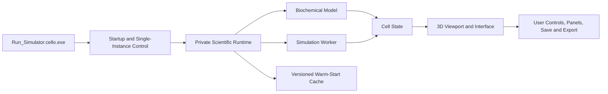

# Cello v1.0.1


**Cello is an interactive biochemical cell simulator and developer-oriented visualization platform.**

The current release provides a usable Windows demo for exploring cellular components, biochemical processes, model state, and experimental interventions through an interactive three-dimensional interface.

## Download

Download the current Windows build from the repository's **Releases** page:

**[Download the latest Cello release](../../releases/latest)**

The release asset should be named:

Cello_1.0.1_Portable_Windows_x64.zip

Do not download the automatically generated GitHub “Source code” ZIP expecting the application. The executable build is attached separately as a release asset.

## Install and run

1. Download `Cello_1.0.1_Portable_Windows_x64.zip` from GitHub Releases.
2. Extract the entire ZIP to a normal folder.
3. Open the extracted `Cello_1.0.1_Portable` folder.
4. Run `Run_Simulator.cello.exe`.
5. Keep `_cello_runtime` beside the launcher; it contains Cello's private runtime.

The first launch initializes the biochemical model, 3D viewport, simulation worker, and initial cell state. Later launches can use a versioned warm-start cache and should normally start faster.

Full instructions: **[INSTALL.md](INSTALL.md)**

## Current capabilities

- Interactive biochemical cell visualization
- Experimental controls for molecules, hormones, and enzymes
- Active-process and model-status inspection
- Cell-state and timeline panels
- Dark and light themes
- Responsive layout from 1024×680 upward
- Save, load, export, and research-oriented interface tools
- Single-instance startup behavior
- Portable Windows deployment with no separate Python installation

## Architecture

The packaged application is organized around a launcher, a bundled scientific runtime, a simulation worker, state/model services, and a 3D viewport.



Read the architecture overview: **[docs/ARCHITECTURE.md](docs/ARCHITECTURE.md)**

## Versioning and releases

Cello uses semantic versioning:

```text
MAJOR.MINOR.PATCH
```

- **MAJOR:** incompatible architectural or model changes
- **MINOR:** new backward-compatible features
- **PATCH:** fixes, packaging improvements, and small refinements

Version history is recorded in **[CHANGELOG.md](CHANGELOG.md)** and **[versions/](versions/README.md)**. Compiled builds are distributed through GitHub Releases rather than committed directly to the repository.

## Scientific scope

Cello is a research-beta simulator and visualization environment. It is not a validated digital twin, clinical device, patient-specific predictor, diagnostic system, or substitute for laboratory validation.

The default parameters are transparent modeling priors rather than a fit to a named cell line, tissue, organism, patient, or clinical cohort. See **[docs/SCIENTIFIC_SCOPE.md](docs/SCIENTIFIC_SCOPE.md)**.

## Repository status

This repository currently serves as the official public distribution, documentation, versioning, and issue-tracking home for the packaged Cello demo. The compiled Windows release is available through GitHub Releases. Source-code publication status is documented in **[SOURCE_STATUS.md](SOURCE_STATUS.md)**.

## Integrity verification

SHA-256 for the official v1.0.1 Windows ZIP:

```text
9f5bef711a02418ea6b2e15016d4dd065ada45e59848cfbeb2e127ab95ea71d3
```

Verification instructions are included in **[INSTALL.md](INSTALL.md)**.

# Changelog

All notable changes to Cello are documented here.

The project follows semantic versioning and uses GitHub Releases for downloadable builds.

## [1.0.1] — 2026-08-06

### Added

- Official portable Windows x64 distribution
- Single user-facing launcher: `Run_Simulator.cello.exe`
- Bundled private Python and scientific runtime
- Desktop shortcut creation after first successful launch
- Cello application and taskbar icon integration
- Versioned warm-start cache

### Improved

- Startup flow now uses one persistent loading window
- Main simulator window appears once after viewport, worker, and cell state readiness
- Warm-start readiness gate reduced from three snapshots to two
- Responsive interface behavior from 1024×680 upward
- Dark mode, contrast icons, panel visibility controls, explicit pH readouts, research tools, and scientific audits retained in the portable build

### Distribution

- Release asset: `Cello_1.0.1_Portable_Windows_x64.zip`
- Platform: Windows x64
- Package type: portable ZIP

### Scientific status

- Research beta
- Not clinically validated
- Not a patient-specific predictor or digital twin

## Earlier development builds

Earlier internal development builds were not formally archived as public GitHub releases. The public version history begins with v1.0.1. This avoids inventing a fake release history for appearances.


## License

Cello's original project materials are currently distributed under the terms in **[LICENSE](LICENSE)**. Bundled third-party software remains governed by its own licenses; see **[THIRD_PARTY_NOTICES.md](THIRD_PARTY_NOTICES.md)**.
