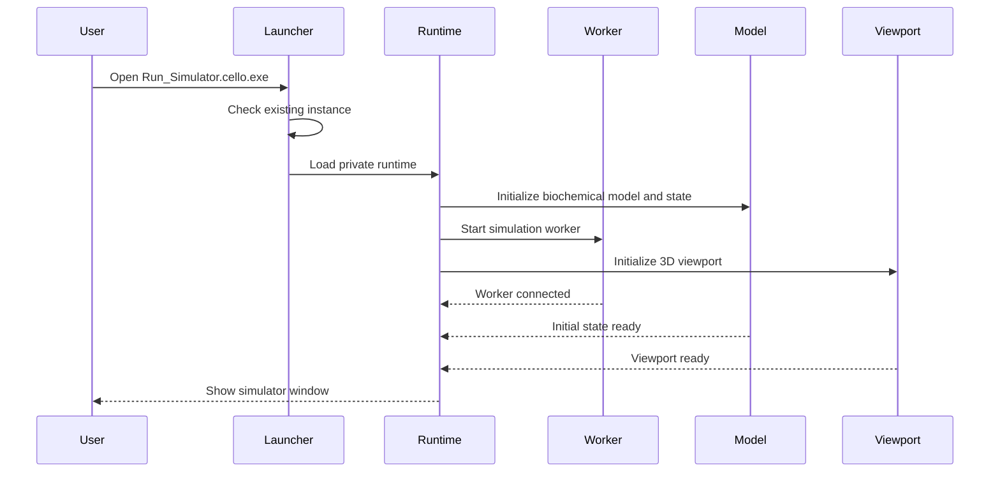

# Architecture overview

This document describes the observable packaged architecture of Cello v1.0.1. It does not claim that the complete implementation is publicly reviewable while the source tree remains unpublished.

## Packaged components

### Launcher

`Run_Simulator.cello.exe` is the single user-facing entry point. It starts the application without requiring a separate Python installation and prevents duplicate simulator/worker instances.

### Private runtime

`_cello_runtime` contains the private Python and scientific runtime, graphical resources, biochemical assets, and packaged dependencies required by the application.

### Startup controller

Startup initializes the biochemical model, 3D viewport, simulation worker, and initial cell state. A persistent loading window remains visible until the application is ready.

### Simulation worker

The simulation worker runs separately from the visible interface flow and connects to the current model/state session before the main simulator becomes ready.

### Model and state

The application initializes a biochemical model and an initial cell state. User controls modify represented entities and processes, while status panels expose model and simulation information.

### Visualization and interface

The interface includes the 3D viewport, cell information, active processes, model status, experimental controls, timeline, footer, themes, and panel visibility controls.

### Warm-start cache

A versioned warm-start cache reduces later startup work after a successful initial launch.

## Runtime flow

## Architectural priorities

- Keep simulation behavior separate from interface rendering
- Keep model state explicit and inspectable
- Keep release startup deterministic and single-instance
- Preserve scientific limitations alongside features
- Make future experiments exportable and reproducible
- Publish source and build instructions before claiming implementation-level reproducibility
